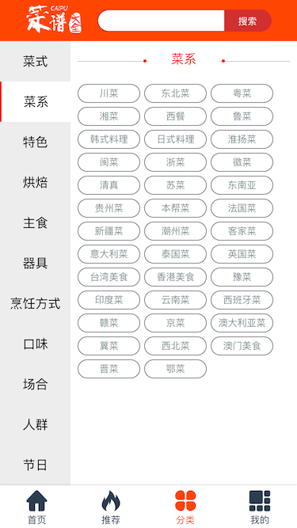
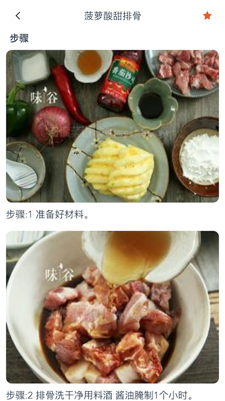
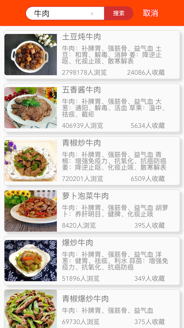

# vue-cookbook

>  基于vue2的菜谱应用,使用vue-cli搭建项目,vue-router做路由管理,
vuex做状态管理,网络请求使用axios.
GitHub地址: [github](https://github.com/Loisme/vue-cookbook)

## 项目截图
* 首页


* 推荐菜谱


* 菜谱分类



* 我的


* 分类列表


* 菜式详情




* 搜索




## 项目安装
``` bash
# 获取项目
git clone https://github.com/Loisme/vue-cookbook.git

# 进入文件夹
cd vue-cookbook

# 安装依赖(npm)
npm install

# 开启本地服务器(http://localhost:9090)
npm run dev

# 项目发布
npm run build
```

## 项目结构
***
<pre>
├── build              // 构建服务和webpack配置
├── config             // 项目不同环境的配置
├── dist               // 项目build目录
├── index.html         // 项目入口文件
├── package.json       // 项目配置文件
├── src                // 生产目录
│   ├── assets         // 图片资源
│   ├── common         // 公共的css js 资源
│   ├── components     // 各种组件
│   ├── App.vue        // 主页面 
│   ├── vuex           // vuex状态管理器
│   ├── router.js      // 路由配置器
│   └── main.js        // Webpack 预编译入口
</pre>

## Vue组件
<pre>
├──item              // item内容数据
│   ├────albumInfo.vue     // 专辑信息
│   ├────albumItem.vue     // 专辑内容
│   ├────comment.vue       // 评论信息
│   ├────imgInfo.vue       // 图片信息
│   └────selection.vue     // 分类数据
├──list             // 列表数据
│   ├────collection.vue    // 收藏列表
│   ├────history.vue       // 历史浏览列表
│   ├────menuList.vue      // 菜谱列表
│   └────searchList.vue    // 搜索列表
├──page             // 页面相关
│   ├────category.vue      // 菜谱分类页面
│   ├────home.vue          // 首页
│   ├────menuCategory.vue  // 特定分类页面
│   ├────menuDetail.vue    // 菜式详情页面
│   ├────my.vue            // 我的页面
│   ├────query.vue         // 搜索页面
│   ├────recommend.vue     // 推荐菜谱页面
│   └────wecome.vue        // 欢迎页面
├──widget           // 控件相关
│   ├────backbar.vue       // 返回的bar组件
│   ├────loading.vue       // 页面加载组件
│   ├────menuRow.vue       // 菜式简介组件
│   ├────searchbar.vue     // 搜索组件
│   └────tabs.vue          // 底部导航栏
</pre>
